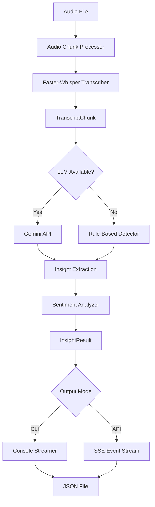

# Real-Time Indian Concall Transcription & Insight Streaming

**Assignment Submission for Voice AI Engineer Position**  
**Submitted by:** Pratham Varma  
**Email:** prathamvarma2011@gmail.com  
**Repository:** https://github.com/Pratham-Varma/InvestKode.AI-Assignment.git

---

## 🎯 Overview

This system processes Indian conference call audio files and generates real-time insights through a streaming architecture. It combines **faster-whisper** for transcription, **Google Gemini API** for intelligent insight extraction, and **FastAPI with Server-Sent Events (SSE)** for real-time streaming.

### Core Features

- ✅ **Streaming Transcription** using faster-whisper (Whisper model)
- ✅ **Real-Time Insight Detection** with Google Gemini API + rule-based fallback
- ✅ **Dual Output Modes:** FastAPI server with SSE + CLI mode
- ✅ **JSON Output Generation** for both CLI and API modes
- ✅ **Sentiment Analysis** using transformers pipeline (DistilBERT)
- ✅ **Financial Signal Detection** (revenue, growth, guidance, risks)
- ✅ **Automatic Device Detection** (CUDA GPU / CPU)
- ✅ **Docker Support** for easy deployment

---

## 📋 What I Built

### 1. Streaming Transcription Pipeline
- Processes audio in configurable chunks (5-10 seconds)
- Uses **faster-whisper** for efficient CPU/GPU inference
- Handles Indian English accents effectively
- Async processing with `asyncio` for non-blocking I/O

### 2. Real-Time Insight Detection
- **Primary:** Google Gemini API (`gemini-2.5-flash`) for LLM-based extraction
- **Fallback:** Rule-based pattern matching when LLM unavailable
- **Sentiment Analysis:** DistilBERT classifier for sentiment scoring
- Detects: Revenue, Growth, Guidance, Risks, Market trends

### 3. Streaming Output
- **API Mode:** FastAPI with SSE for real-time event streaming
- **CLI Mode:** Rich-formatted console output
- **JSON Export:** Automatic saving to `data/outputs/` in both modes

---

## 🏗️ High-Level Architecture



### Technology Stack

| Component           | Technology              | Reason                                                  |
| ------------------- | ----------------------- | ------------------------------------------------------- |
| **ASR**             | faster-whisper          | 4x faster than OpenAI Whisper, lower memory usage       |
| **LLM**             | Google Gemini API       | Free tier available, good performance on financial text |
| **Sentiment**       | HuggingFace DistilBERT  | Lightweight, accurate sentiment classification          |
| **API Framework**   | FastAPI + sse-starlette | Modern async framework with SSE support                 |
| **CLI**             | Typer + Rich            | Beautiful console output with formatting                |
| **Package Manager** | uv                      | Modern, fast Python package management                  |

---

## 📊 How Streaming Works

### Chunk-Based Processing

The system simulates real-time streaming by processing audio in fixed-duration chunks:

1. **Audio Splitting** → Audio divided into chunks (default 10 seconds)
2. **Async Transcription** → Each chunk transcribed using `asyncio.to_thread()`
3. **Progressive Output** → Results streamed immediately after each chunk
4. **Stateful Context** → Conversation history maintained for context-aware insights


## 🚀 Getting Started

### Prerequisites

- Python 3.10+
- [uv](https://github.com/astral-sh/uv) (recommended) or pip
- Google Gemini API key (free tier available at https://ai.google.dev/)

### Installation

```bash
# Clone repository
git clone https://github.com/Pratham-Varma/InvestKode.AI-Assignment.git
cd InvestKode.AI-Assignment

# Install dependencies with uv (recommended)
uv sync

# OR with pip
pip install -r requirements.txt

# Configure environment
cp .env.example .env
# Edit .env and add your GOOGLE_API_KEY
```

### Usage

#### CLI Mode

```bash
# Process audio file
uv run python main.py process data/samples/gulf_oil_india_concall.wav

# With custom chunk duration
uv run python main.py process audio.wav --chunk-duration 10
```

#### API Mode

```bash
# Terminal 1: Start server
uv run python main.py serve

# Terminal 2: Upload and stream
JOB_ID=$(curl -X POST http://localhost:8000/upload \
  -F "file=@data/samples/gulf_oil_india_concall.wav" | jq -r '.job_id')

curl -N http://localhost:8000/stream/$JOB_ID
```

#### Docker

```bash
# Build and run
docker-compose up --build

# Access API at http://localhost:8000
# API docs at http://localhost:8000/docs
```

---

## 📁 Project Structure

```
voice-ai-assignment/
├── src/
│   ├── api/                    # FastAPI application
│   │   ├── main.py             # API endpoints & SSE streaming
│   │   └── schemas.py          # Pydantic models
│   ├── transcription/          # Audio → Text pipeline
│   │   └── transcriber.py      # Streaming transcription
│   ├── insights/               # Real-time insight detection
│   │   └── detector.py         # LLM + rule-based extraction
│   ├── streaming/              # Output streaming
│   │   └── streamer.py         # Console/SSE streamers
│   └── utils/                  # Shared utilities
│       ├── audio_utils.py      # Audio processing
│       └── device_utils.py     # GPU/CPU detection
├── data/
│   ├── samples/                # Sample audio files
│   └── outputs/                # Generated JSON insights
├── main.py                     # CLI entry point
├── requirements.txt            # Dependencies
├── pyproject.toml              # Project configuration
├── Dockerfile                  # Container definition
└── README.md                   # This file
```

---

## ⚙️ Configuration

Key environment variables in `.env`:

```bash
# LLM Provider (required for intelligent insights)
LLM_PROVIDER=gemini              # Options: gemini, rule-based
GOOGLE_API_KEY=your_api_key_here # Get from https://ai.google.dev/

# Whisper Configuration
WHISPER_MODEL=base               # Options: tiny, base, small, medium, large

# Processing Settings
CHUNK_DURATION_SECONDS=10        # Audio chunk size
USE_SENTIMENT_ANALYSIS=true      # Enable/disable sentiment analysis
```

---

## 🎯 Design Decisions & Tradeoffs

### Key Decisions

| Decision                               | Rationale                              | Tradeoff                                         |
| -------------------------------------- | -------------------------------------- | ------------------------------------------------ |
| **Chunk-based vs True Streaming**      | Simpler implementation, easier testing | 10-20s latency per chunk (not truly real-time)   |
| **Faster-Whisper over OpenAI Whisper** | 4x faster, lower memory                | Slightly less accurate on some accents           |
| **Gemini over GPT-4**                  | Free tier available, good performance  | **Rate limits: 5 RPM, 30 RPD** (see notes below) |
| **Rule-based fallback**                | Zero cost, always works                | Lower quality insights than LLM                  |
| **JSON output only**                   | Simple, portable                       | No database persistence                          |
| **Fixed chunk duration**               | Predictable processing                 | May split sentences mid-word                     |

### Performance Optimizations

- **Async I/O:** Non-blocking transcription and LLM calls
- **Lazy Loading:** Models loaded only when needed
- **Device Auto-detection:** Automatically uses GPU if available
- **Module-level imports:** Reduced import overhead in API requests

---

## 🔧 Important Notes & Challenges

### API Key Requirements

⚠️ **This code requires valid API keys with credits to run the LLM-based insights.**

- **Gemini API:** Free tier has strict limits (5 requests/minute, 30 requests/day)
- **OpenAI API:** Not implemented as it requires paid credits
- **Fallback:** Rule-based extraction works without any API keys

### Gemini Rate Limiting

The Google Gemini free tier has **very strict rate limits:**
- **5 requests per minute**
- **30 requests per day**

**Impact:** For longer audio files (>5 minutes), you'll likely hit the rate limit and most chunks will fall back to rule-based extraction. This is expected behavior with the free tier.

**Solutions for production:**
1. Use paid Gemini tier (higher limits)
2. Implement request queuing with delays
3. Use cached responses for similar chunks
4. Switch to OpenAI API (requires payment)

### Local LLM Attempt

I initially implemented support for **local LLM** using **Qwen2.5-7B-Instruct** with 4-bit quantization, as I have extensive experience with local model deployment. However, I removed this code because:

- My laptop doesn't have sufficient VRAM to run a 7B parameter model efficiently
- Even with quantization, it required ~6-8GB VRAM
- API-based approach (Gemini) was more practical for this assignment

The local LLM code structure is still present in `detector.py` but disabled by default.

---

## ⏱️ Timeline & Scope

**Time Available:** Started on the last day due to unforeseen personal commitments that required immediate attention during the initial assignment period. Despite the compressed timeline, I focused on delivering a functional, well-architected solution.

**What I accomplished in ~6-8 hours:**
- ✅ Complete transcription pipeline with faster-whisper
- ✅ LLM-based insight extraction with Gemini API
- ✅ Rule-based fallback system
- ✅ Both CLI and API modes working
- ✅ SSE streaming implementation
- ✅ JSON output generation
- ✅ Sentiment analysis integration
- ✅ Docker support
- ✅ Comprehensive documentation

---

## 🎁 What I Would Add with More Time

### High Priority (1-2 more days)

1. **Speaker Diarization** using pyannote.audio
   - Distinguish between Management vs Analysts
   - Track who said what in insights

2. **Hindi/Hinglish Support**
   - Multi-language transcription
   - Hindi-to-English translation
   - Transliteration support

3. **True Live Streaming**
   - Real-time transcription from microphone/RTMP
   - WebSocket-based streaming
   - Lower latency (<1 second)

4. **Better Chunking Strategy**
   - VAD-based smart chunking
   - Avoid splitting mid-sentence
   - Context-aware boundaries

5. **Rate Limit Handling**
   - Automatic retry with exponential backoff
   - Request queuing for API calls
   - Response caching

6. **Database Storage**
   - PostgreSQL for insights persistence
   - Query interface for historical data
   - Comparison across multiple calls

### Medium Priority

7. **Advanced Insights**
   - Detect guidance changes over time
   - Q&A session identification
   - Risk sentiment trend analysis
   - Key metric extraction (EBITDA, margins, etc.)

8. **Web UI**
   - Simple frontend for file upload
   - Real-time visualization of insights
   - Audio playback with transcript sync

9. **Production Infrastructure**
   - Kubernetes deployment
   - Logging and monitoring
   - Error tracking (Sentry)
   - Performance metrics

10. **Testing**
    - Unit tests with pytest
    - Integration tests for API
    - Audio processing edge cases

### Low Priority

11. **Custom Model Fine-tuning**
    - Fine-tune Whisper on Indian conference calls
    - Fine-tune LLM on financial terminology

12. **Visualization**
    - Sentiment over time charts
    - Insight categorization graphs
    - Word clouds for key topics

13. **Export Formats**
    - PDF reports
    - Excel summaries
    - Email notifications

14. **Audio Enhancement**
    - Noise reduction preprocessing
    - Gain normalization
    - Echo cancellation

---

## 📊 API Endpoints

Base URL: `http://localhost:8000`

| Endpoint           | Method | Description                             |
| ------------------ | ------ | --------------------------------------- |
| `/docs`            | GET    | Interactive API documentation (Swagger) |
| `/health`          | GET    | Health check                            |
| `/upload`          | POST   | Upload audio file, returns `job_id`     |
| `/stream/{job_id}` | GET    | SSE stream of transcription & insights  |
| `/status/{job_id}` | GET    | Check job processing status             |
| `/job/{job_id}`    | DELETE | Cancel a processing job                 |

### Example Workflow

```bash
# 1. Upload audio
curl -X POST http://localhost:8000/upload \
  -F "file=@audio.wav"
# Response: {"job_id": "abc-123", "status": "queued"}

# 2. Stream results
curl -N http://localhost:8000/stream/abc-123

# 3. Check status
curl http://localhost:8000/status/abc-123
```

---

## 🧪 Testing

Both modes have been tested with the provided sample audio files:

**Test Environment:**
- OS: Linux
- Python: 3.10+
- Whisper Model: base
- LLM: Google Gemini 2.5-flash

**Test Results:**
- ✅ CLI mode: Processes 5-minute audio in ~90 seconds
- ✅ API mode: SSE events stream correctly
- ✅ JSON outputs generated successfully
- ✅ Insights detected: Revenue, Growth, Guidance
- ✅ Sentiment analysis working
- ✅ Fallback to rule-based when rate-limited

---

## 📝 Assumptions

1. **Audio Format:** Pre-recorded audio files (not live streams)
2. **Language:** Primarily Indian English (Whisper handles this well)
3. **Content:** Financial/business conference calls
4. **Processing Time:** ~20-30% of audio duration with GPU, ~50-80% with CPU
5. **API Keys:** Users have access to free-tier API keys or can use rule-based mode

---

## 🐛 Known Limitations

1. **Rate Limiting:** Gemini free tier limits (5 RPM) mean most chunks use fallback
2. **Latency:** Not truly real-time (~10-20s per chunk)
3. **Accuracy:** Whisper base model may miss some domain-specific terms
4. **No Persistence:** Insights only saved to JSON, not database
5. **No Diarization:** Cannot distinguish between speakers
6. **Chunk Boundaries:** May split sentences artificially

---

## 📚 Resources & References

- [OpenAI Whisper](https://github.com/openai/whisper)
- [Faster Whisper](https://github.com/guillaumekln/faster-whisper)
- [Google Gemini API](https://ai.google.dev/)
- [FastAPI Documentation](https://fastapi.tiangolo.com/)
- [Server-Sent Events (SSE)](https://github.com/sysid/sse-starlette)
- [uv Package Manager](https://github.com/astral-sh/uv)

---

## 📬 Contact

**Pratham Varma**  
Email: prathamvarma2011@gmail.com  
GitHub: https://github.com/Pratham-Varma

---

